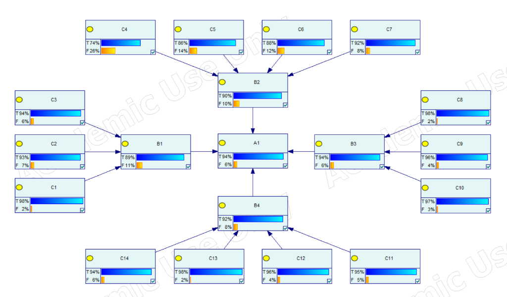

# Airport System Resilience Assessment

A Bayesian Network-based approach for evaluating airport system resilience using the Best-Worst Method (BWM) for expert judgment aggregation.

## Overview

This project assesses the resilience of Chinese airport systems across three categories using:
- **14 risk factors** (C1–C14) covering personnel, equipment, environment, and management
- **4 resilience dimensions**: Preparation (B1), Resistance (B2), Recovery (B3), Optimization (B4)
- **Overall Resilience** (A1) as the target node



## Results

| Airport Category | Resilience Score | 95% CI |
|------------------|------------------|--------|
| Category I (Major hubs) | 85.3% | [83.1%, 87.5%] |
| Category I-2nd (Regional) | 83.9% | [82.7%, 85.1%] |
| Category II (Medium) | 79.3% | [78.9%, 81.6%] |

## Repository Structure

```
├── Model/
│   ├── Bayesian_network.xdsl      # GeNIe Bayesian Network model
│   ├── priors.csv                 # Prior probabilities by airport category
│   ├── A1_cpt.csv                 # CPT for Overall Resilience
│   ├── B1_cpt.csv                 # CPT for Preparation Ability
│   ├── B2_cpt.csv                 # CPT for Resistance Ability
│   ├── B3_cpt.csv                 # CPT for Recovery Ability
│   └── B4_cpt.csv                 # CPT for Optimization Ability
├── Data/                          # Incident data by airport category
│   ├── incidents_category_I.csv
│   ├── incidents_category_I_2nd.csv
│   └── incidents_category_II.csv
└── BWM/                           # Best-Worst Method expert judgments
    ├── A1/, B1/, B2/, B3/, B4/    # AB & AW matrices per node
```

## Requirements

- [GeNIe Academic](https://www.bayesfusion.com/genie/) for model visualization and inference

## Methodology

1. **Prior Probabilities**: Derived from incident frequency data
2. **CPT Generation**: Best-Worst Method with 10 domain experts
3. **Inference**: Bayesian Network propagation in GeNIe
4. **Validation**: Bootstrap confidence intervals (1,000 iterations)

## License

This project is for academic research purposes.
